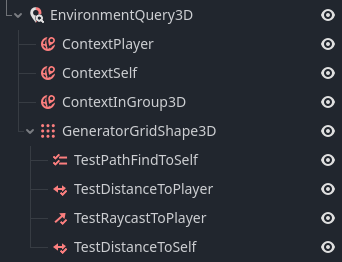

# GEQO

_Godot Environment Query Orchestrator (GEQO)_ is a node-based environment querying system for Godot 4, inspired by Unreal Engine's EQS.
It allows AI agents to evaluate the world around them and select the best position/node/item based on customizable generators and tests (e.g distance, visibility), made around contexts (Any node with a position value).
It is implemented in C++ as a GDExtension for higher performance and support for multiple concurrent queries.

## Features

### Node based environment queries

- Build queries visually by combining Generators (where to sample positions) and Tests (how to evaluate them), similar to Unreal's EQS workflow.

### Visual debugging in 2D and 3D

- Debug queries at runtime by enabling `Visible Navigation` in Godot's Debug tab.
- Color-coded visualizations display the sampled points and their scores.

### Written in C++ GDExtension with performance in mind.

- Implemented in C++, using PhysicsDirectSpaceState for fast queries on objects and areas.
- Time-sliced query processing, spreading the workload of each query across multiple frames to prevent lag spikes during gameplay.

## Example



## How to Use

For more information, see 

```gdscript
var query_result: QueryResult3D = $EnvironmentQuery3D.request_query()
```

This will return a query result that you can then get a best position with the following:

```gdscript
var best_position: Vector3 = query_result.get_highest_score_position()
var best_node: Node = query_result.get_highest_score_node()
```

## Download

## Credits
