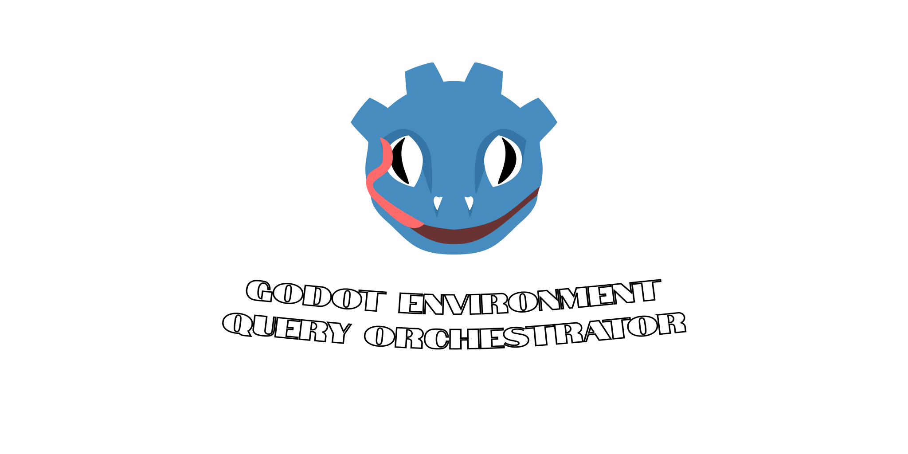
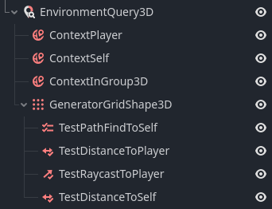

_Godot Environment Query Orchestrator (GEQO)_ is a node-based environment querying system for Godot 4.5+, inspired by Unreal Engine's EQS.
It allows AI agents to evaluate the world around them and select the best position/node/item based on customizable generators and tests (e.g distance, visibility), made around contexts (Any node with a position value).
It is implemented in C++ as a GDExtension for higher performance.

## Features

### Node based environment queries

- Build queries in the scene tree by combining Generators (where to sample positions) and Tests (how to evaluate them), similar to Unreal's EQS workflow.

### Visual debugging in 2D and 3D

- Debug queries at runtime by enabling `use_debug_shapes` in an EnvironmentQuery.
- Color-coded visualizations display the sampled points and their scores.

### Written in C++ GDExtension with performance in mind.

- Implemented in C++, using PhysicsDirectSpaceState for fast queries on objects and areas.
- Time-sliced query processing, spreading the workload of each query across multiple frames to prevent lag spikes during gameplay.

### Various built-in nodes to jump straight into designing.

- 4 contexts
- 4 generators
- 5 tests

### Custom contexts and tests

Extend GEQO with custom logic using GDScript.

For examples, see [example custom scripts](project/example_custom_scripts)

## Query Example



## How to Use

For more information, see [Getting Started](./GETTING_STARTED.md)

Connect signal, then request a query.

```gdscript
func _ready():
    $EnvironmentQuery3D.query_finished.connect(_on_query_finished)
    $EnvironmentQuery3D.request_query()
```

After the query finished, the signal is emitted and you can use the results.

```gdscript
func _on_query_finished(result: QueryResult3D):
    var best_position: Vector3 = result.get_highest_score_position()
    var best_node: Node = result.get_highest_score_node()
    # Use the results on your navigation implementation
    navigate_to(best_position)
```

You can also use `await` to wait until the query is over and access the result.

```gdscript
$EnvironmentQuery3D.request_query()
await $EnvironmentQuery3D.query_finished
var query_result: QueryResult3D = $EnvironmentQuery3D.get_result()
var best_position: Vector3 = query_result.get_highest_score_position()
```

## Download

1. Grab the latest release compatible with your Godot version.
2. Unpack the `addons/geqo` folder into your `/addons` folder in your Godot project.
3. Enable the addon within the Godot settings: `Project > Project Settings > Plugins`

## Credits

- Node logos by [@BenjaTK](https://benjatk.neocities.org/)
